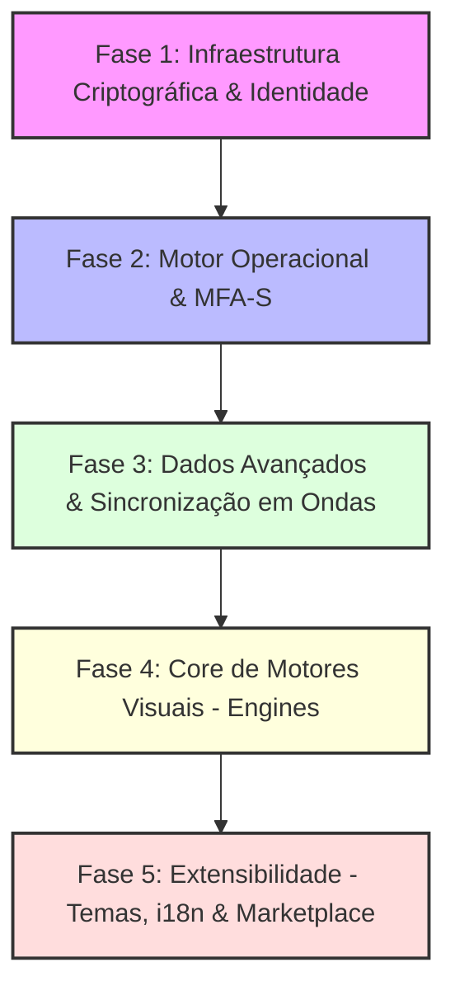

# Plataforma V3.0 — Documento 5: Plano de Implementação Geral

**Versão:** 1.0 (Inicial)  
**Status:** Plano de Implementação / Proposta  
**Referências:** Documento 1 (Fundamentos), Documento 2 (Dados e Sincronização), Documento 3 (Modelo Operacional), Documento 4 (UI e Engines)

---

## 1. Visão Geral e Diagnóstico de Lacunas (Gap Analysis)

Este documento apresenta o plano estratégico e técnico para materializar a **Plataforma V3.0 (Local-First & P2P)**. A análise comparativa entre o estado atual do repositório (`packages/core`, `apps/web`, `apps/cloud`) e as especificações dos Documentos de 1 a 4 revela a seguinte matriz de conformidade:

| Componente Sistêmico | Funcionalidade Especificada | Estado Atual no Código | Lacuna Identificada / Ações Necessárias |
| :--- | :--- | :--- | :--- |
| **Camada de Dados** | SQLite + OPFS + Yjs no Sync Worker | **Parcialmente Implementado** | Persistência offline e sync WebRTC básico funcionam. Sem suporte a descriptografia dinâmica (Lazy Decryption), nem quota ou GC híbrido (G4). |
| **Camada de Dados** | Projeções Locais por Triggers | **Parcialmente Implementado** | `entity_heads` e `active_edges` funcionam via Triggers. Faltam tabelas de busca (FTS5), geolocalização (R\*Tree) e balances financeiros. |
| **Segurança** | Criptografia Multi-Camadas | **Não Implementado** | Payloads e arestas são transmitidos e armazenados em texto plano. É urgente criar a criptografia AES-GCM por época e o KMS online-optional. |
| **Segurança** | Controle de Acesso (UCAN) | **Não Implementado** | Falta representação de `ASSET:CAPABILITY` e `ASSET:ROLE` baseadas em tokens UCAN criptográficos com delegação recursiva. |
| **Segurança** | Recuperação de Acesso | **Não Implementado** | Não há fluxo de recuperação via Shamir (SSS) 2-de-3 ou sementes BIP39. |
| **Modelo Operacional** | Ciclo Intenção → Validação | **Não Implementado** | Inserções no SQLite são diretas. É necessário criar a entidade `CONTENT:INTENT` e o pipeline de validação (local, single-validator e quórum). |
| **Modelo Operacional** | Auditoria MFA-S | **Não Implementado** | Sem encadeamento de hashes (`previous_hash`) ou assinaturas universais Ed25519 nos nós/arestas. Sem coalescência em CRDT. |
| **Sincronização** | Modelo em Ondas | **Não Implementado** | O app baixa todo o estado Y.js de uma vez. É necessário isolar a Onda 0, 1, 2 e o Lazy Load da Onda 3. |
| **Sincronização** | Graph-Based Routing | **Não Implementado** | Apenas uma sala global `'global-room'` é utilizada. É necessário implementar a descoberta de peers e reidratação a partir da topologia do grafo. |
| **Sincronização** | Replicação Coordenada | **Não Implementado** | Sem cálculo de Replication Factor, Gossip de poda ou Sharding determinístico na rede pública. |
| **Interface (UI)** | Motores Visuais (Engines) | **Parcialmente Implementado** | Apenas `Timeline` e `SuperCard` existem em versões extremamente básicas. Faltam 13 engines fundamentais do Padrão A. |
| **Interface (UI)** | Temas & i18n como Dados | **Não Implementado** | Temas e i18n são declarados em código/CSS estático. Precisamos migrar para nós `CONTENT:THEME` e `CONTENT:TRANSLATION` dinâmicos. |

---

## 2. Cronograma de Sprints e Fases

O plano está estruturado em **5 Fases Sequenciais**, organizadas de forma a construir a base criptográfica e operacional antes de avançar para os motores visuais e recursos dinâmicos.



---

## 3. Detalhamento das Fases

### Fase 1: Infraestrutura Criptográfica, Identidade e Segurança (O Alicerce)
*Foco: Garantir que a identidade do usuário, chaves e capacidades de acesso existam de forma matematicamente segura antes de sincronizar ou exibir dados.*

#### 3.1. Chave Mestra e Derivação Local
- **Implementação**: Criação do `IdentityManager` no Web Worker do cliente.
- **Assinaturas**: Geração de chaves Ed25519 (usando Web Crypto API nativa do browser ou biblioteca otimizada como `@noble/curves`).
- **Segurança local**: Cifragem de chaves locais usando a chave do dispositivo derivada por PBKDF2 a partir da senha do usuário.
- **BIP39**: Suporte a seed phrases de 12/24 palavras para o modelo *user_only*.

#### 3.2. Cifragem AES-256-GCM por Épocas
- **Estrutura de dados**: Criação de payloads encriptados. Cada nó/aresta terá seu payload e IV guardados como BLOBs em SQLite.
- **Chaves de Época**: Armazenamento em cache volátil no `CryptoWorker` (RAM apenas, TTL de 4 horas).
- **Mapeamento de Épocas**: Indexação da coluna `epoch` nas tabelas `nodes` e `edges` para busca rápida durante rotação de chaves.

#### 3.3. UCAN & ASSET:CAPABILITY
- **Especificação**: Representação em Typescript de tokens UCAN (User Controlled Authorization Networks).
- **Relação com o Grafo**: Mapeamento de UCANs como nós `ASSET:CAPABILITY` e arestas `DELEGATED_TO` apontando para a persona detentora.
- **Validação Criptográfica**: Verificação de cadeia de delegação e expiração (TTL do token UCAN).

#### 3.4. Shamir's Secret Sharing (SSS) para Recuperação
- **Algoritmo**: Implementação da divisão de segredos 2-de-3 (Dispositivo, Provedor/Fundador, Canal Externo).
- **Fluxo de Recuperação**: Telas dedicadas e endpoints HTTP simulando a reconstituição da chave mestra a partir de dois fatores independentes.

---

### Fase 2: Motor Operacional e Consistência (MFA-S e Validação)
*Foco: Estruturar as regras que governam como o estado muda de forma imutável, auditável e segura.*

#### 4.1. O Ciclo Intenção → Validação → Ação
- **Fila de Intenções**: Criação da tabela local `pending_intents` no SQLite do cliente.
- **Ciclo Otimista**: Se a SPECIFICATION declarar `validation: auto_self`, a intenção é descartada e o nó/aresta principal é inserido de forma imediata na UI, com propagação via Yjs.
- **Ciclo Assíncrono**: Para validação externa (single-validator ou multi-sig), a intenção (`CONTENT:INTENT`) é materializada e sincronizada com os validadores. O nó final só é criado após a consolidação (recebimento de arestas `APPROVED_BY` e processamento da aresta `RESOLVES`).

#### 4.2. MFA-S (Multi-Factor Audit Semantic) e Integração Y.js/SQLite
- **Duas Trilhas de Dados**: Implementação da Trilha CRDT (efêmera no Y.js/SQLite para sync e undo) e Trilha Semântica (persistente no SQLite em `audit_logs`).
- **Tabelas do Framework**: Criação física de `snapshots`, `yjs_updates`, `pending_staging` e `audit_logs` no banco de dados SQLite local.
- **Semantic Mapper**: Mapeamento de modificações capturadas via `observeDeep` do Y.js e conversão para logs legíveis com dados de antes/depois, userId, path e vector_clock.
- **Coalescência e Concorrência**: Agrupamento temporal das edições (timeout de 10s). Quebra do agrupamento de forma inteligente se o Vector Clock indicar edições concorrentes de múltiplos peers no mesmo nó.
- **Crash Recovery**: No startup do worker, processamento automático de dados pendentes da tabela `pending_staging` pelo Semantic Mapper.
- **Recursos Avançados**: Implementação do Undo Semântico (reversão via logs históricos de antes/depois) e Publicação Shadow (exportação estática Markdown/JSON limpa).

#### 4.3. Validador de Domínio
- **Motor de Validação**: Classe genérica que avalia a SPECIFICATION ligada ao nó.
- **Regras estendidas**: Suporte a expressões ou WebAssembly em specs para validação lógica de campos e pré-condições de recursos.

---

### Fase 3: Camada de Dados Avançada e Sincronização (Ondas, Rotas e GC)
*Foco: Elevar a performance da persistência local, do tráfego de rede e do gerenciamento de armazenamento do dispositivo.*

```
Onda 0 (Segundos)   --> Identidade, UCANs e Specifications de Rede
Onda 1 (Minutos)    --> Chats recentes (30d), Notificações e saldos quentes
Onda 2 (Background) --> Histórico antigo como nós Casca (Podados)
Onda 3 (Sob Demanda)--> Reidratação de Casca -> Integral via Graph-Based Routing
```

#### 5.1. Projeções Estruturais e Índices Locais
- **FTS5 no SQLite**: Trigger nativa escrevendo palavras-chave em tabelas FTS5 (`search_index_fts`) apenas para campos definidos como `searchable: true` no payload descriptografado.
- **Balanços**: Tabela `asset_balances` mantida por triggers que agregam débitos e créditos de arestas de ativos.
- **Geo-Index**: Integração com módulo R\*Tree do SQLite local para buscas espaciais rápidas.

#### 5.2. Sincronização em Ondas (Waves)
- **Implementação**: Priorização de download de documentos Y.js.
- **Onda 0**: Sincronização imediata de identidades, chaves e specs de rede.
- **Onda 1**: Sincronização das últimas conversas e dados operacionais urgentes.
- **Onda 2**: Download em background de metadados históricos (nós criados com `retention_state = 'pruned'`).

#### 5.3. Graph-Based Routing
- **Cascas (Shallow Nodes)**: Nós criados localmente sem a coluna `payload` (apenas metadados e assinaturas).
- **Reidratação Dinâmica**: Ao tentar renderizar um nó podado, a UI dispara uma requisição via Graph-Based Routing: o cliente percorre as arestas locais do mesmo contexto, identifica os IDs de peers no mesmo grupo que possuem o nó e solicita o delta criptografado via WebRTC.

#### 5.4. GC Híbrido (G4) e Quotas
- **Enforcement de Quotas**: Cálculo de armazenamento ocupado pelo banco OPFS.
- **Mecanismo G4**: Ao atingir 90% da quota, o GC local notifica o usuário e inicia a poda de nós antigos (Integral → Podado) respeitando `ASSET:PIN` (nós protegidos pelo usuário) e regras de retenção legal forçada.
- **Co-Compactação Yjs**: Instrução de Garbage Collection disparada ao Yjs para consolidar históricos de edições concomitantes à poda do SQLite.

---

### Fase 4: Core de Motores Visuais (Engines do Padrão A)
*Foco: Desenvolver as 13 engines fundamentais especificadas no Documento 4, garantindo a reusabilidade disciplinada.*

Todas as engines herdarão a estrutura do **Padrão A**: motores genéricos no core do design system, especializados por meio de wrappers nomeados nos módulos de negócio.

#### 6.1. Motores de Coleção e Entidade
- **Layout Engine**: Motor reativo baseado em Tailwind CSS para renderizar grades, listas densas ou tabelas, com suporte nativo a virtualização extrema (`react-window` ou similar) e *container queries*.
- **Filter Engine**: Interpretador de filtros em JSON. Gera automaticamente inputs de busca, ranges, seletores de data e gerencia o estado da consulta ao SQLite.
- **Entity Picker**: Input inteligente conectado às tabelas de índice FTS5 do SQLite com suporte a autocomplete e busca federada.
- **SmartForm**: Motor guiado por `SPECIFICATION`. Renderiza inputs, valida dados com base nas regras da especificação e salva rascunhos de forma otimista.

#### 6.2. Motores de Interação e Processos
- **Composer**: Input enriquecido com suporte a slash-commands (`/`), @mentions, upload de ativos e controle de digitação em tempo real.
- **ContextMenu & BottomSheet**: Componentes mobile-first baseados em Radix / shadcn/ui com suporte a gestos físicos de arrastar e haptics.
- **StateMachine**: Renderizador de fluxos visualizável como Kanban ou Stepper. Consome a máquina de estados declarada em uma especificação de processo.
- **AuditTrail**: Linha do tempo especializada na Linhagem de Versões MFA-S, permitindo visualizar diffs semânticos e viajar no tempo (Time Travel).

#### 6.3. Motores Especializados
- **GeoSpatial**: Componente de mapas com duas variantes sobre a mesma API: `GeoSpatial:Geographic` (Mapbox/Leaflet) e `GeoSpatial:Cartesian` (coordenadas planas para plantas industriais).
- **RelationGraph**: Visualizador de grafos em WebGL/Canvas para exibir organogramas, redes supply chain e estruturas de governança.
- **WorkspaceShell**: Shell estrutural para ferramentas produtivas, com sidebar colapsável, cabeçalho colaborativo e canvas flutuante.

---

### Fase 5: Extensibilidade Dinâmica (Temas, i18n e Marketplace)
*Foco: Transformar a customização visual e de linguagem em dados dinâmicos governados e sincronizados pelo próprio grafo.*

#### 7.1. Sistema de Temas VSCode-like em SQLite
- **Especificação**: Nó do tipo `CONTENT:THEME` contendo um dicionário YAML de variáveis CSS Custom Properties HSL.
- **Runtime**: Injeção dinâmica no `:root` HTML ao selecionar o tema, sem necessidade de reload.
- **Acessibilidade**: Garantia de que o usuário possa forçar o contraste e modo escuro, ignorando políticas restritivas do dono da rede.

#### 7.2. Internacionalização (i18n) como Dados
- **Especificação**: Nó do tipo `CONTENT:TRANSLATION` mapeando chaves de tradução canônicas.
- **Tradução Comunitária**: Fluxo onde múltiplos tradutores podem sugerir termos, validados por curadores e distribuídos via Yjs.

#### 7.3. Marketplace Primitivo
- **Catálogo**: Engine especializada de busca e instalação de extensões (`CONTENT:THEME`, `CONTENT:TRANSLATION`, `CONTENT:BPMN_TEMPLATE`).
- **Validação de Entrada**: Verificação automatizada de contraste para novos temas e integridade de chaves para novas traduções antes da publicação oficial.

---

## 4. Plano de Verificação e Testes

Para garantir a correção e resiliência da plataforma, o plano de testes cobrirá os seguintes níveis:

### 4.1. Testes Automatizados (Vitest)
- **Criptografia**: Testes unitários de cifragem AES-GCM, assinatura Ed25519 e verificação UCAN.
- **Operacional**: Teste de integridade de linhagem de hashes (MFA-S), simulando tentativas de bifurcação e adulteração histórica.
- **Sync Worker**: Teste de estresse com injeção concorrente no Yjs, observando a velocidade de gravação dos Triggers SQLite.

### 4.2. Testes de Integração e Rede (Cypress / Playwright)
- **Sincronização em Ondas**: Simulação de latência de rede para validar se a interface fica usável em menos de 2 segundos (Onda 0) enquanto o histórico (Onda 2) é baixado de forma silenciosa.
- **Graph-Based Routing**: Desconexão de peers validadores para verificar se as intenções entram em modo pendente na UI de forma resiliente e honesta.

### 4.3. Testes Manuais com Browser Subagent
- **Acessibilidade**: Validação manual das Engines com leitores de tela e navegação por teclado.
- **Performance**: Execução em dispositivos simulados de baixo desempenho para observar a degradação de tier ativada automaticamente.

---

## 5. Perguntas em Aberto para o Usuário

> [!IMPORTANT]
> A análise revelou três pontos estratégicos cruciais que necessitam de direcionamento do usuário antes de iniciarmos a codificação:

1. **Biblioteca Criptográfica Base**: Para assinaturas Ed25519 e Shamir's Secret Sharing (SSS) na Web e Cloud, prefere o uso de primitivas nativas da Web Crypto API complementadas por `@noble/curves` (altamente performática e auditada) ou existe alguma biblioteca padrão já estabelecida na sua infraestrutura?
2. **KMS Online-Optional**: Para redes corporativas que exigem forward secrecy estrito, o Key Management Service (KMS) que gerencia as chaves de época deve rodar como um microserviço dedicado ou prefere que a rotação e distribuição de chaves seja coordenada de forma autônoma entre super peers via SPECIFICATIONS dedicadas?
3. **Escopo da IA Local (Generator)**: O Documento 1 menciona que a engine `Generator` (IA local baseada em WebGPU) terá seu desenvolvimento inicial diferido. Deseja que deixemos a infraestrutura de hooks e skeletons do `Generator` pronta nesta primeira entrega ou prefere focar 100% no motor offline/P2P e nas engines visuais clássicas do Padrão A?
