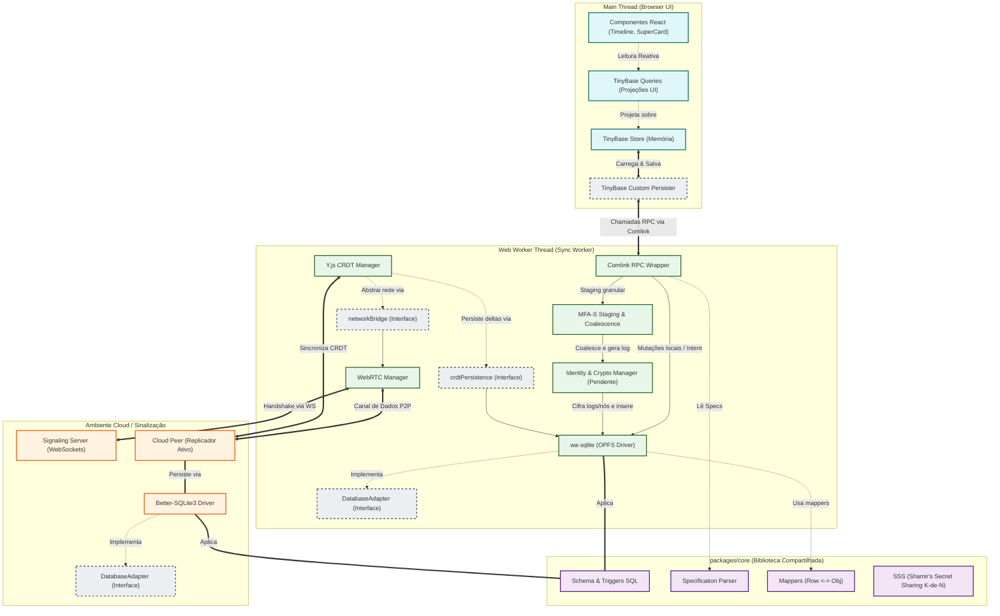
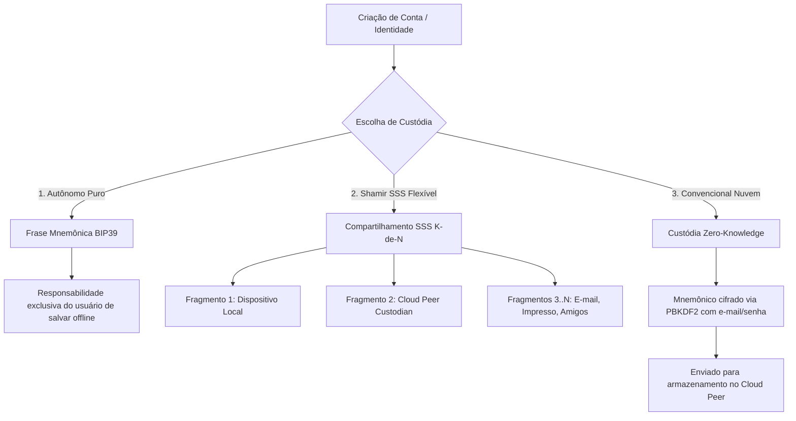
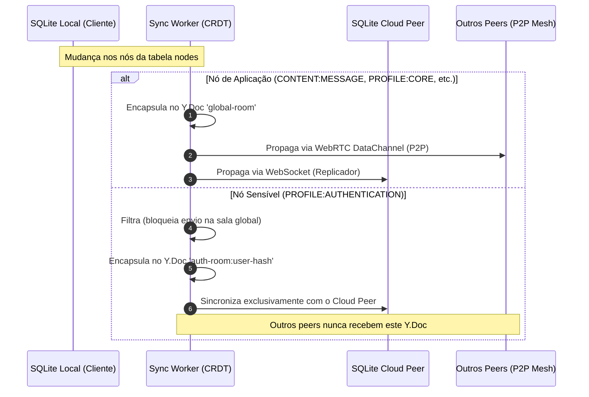

# Arquitetura e Fluxo de Dados — Plataforma V3.0 (Local-First)

Este documento descreve a topologia de camadas, o fluxo de dados reativo e o nível de acoplamento/desacoplamento das peças do sistema. Ele serve de guia para garantir a intercambiabilidade dos componentes (como bancos de dados, conexões de rede e engines visuais).

---

## Diagrama de Arquitetura e Acoplamento

O diagrama abaixo divide o sistema em **Camadas Físicas (Threads/Processos)** e destaca os **Pontos de Desacoplamento (Interfaces)** que permitem a substituição de componentes sem impacto no restante da aplicação.

---

## Modelos de Identidade e Recuperação Previstos

O sistema suporta três modelos distintos de custódia e recuperação de identidade, garantindo flexibilidade e segurança para diferentes tipos de usuários:

### 1. Recuperação Autônoma (Mnemônico BIP39)
* **Fluxo:** O usuário gera uma frase semente de 12 ou 24 palavras (BIP39). O par de chaves Ed25519 de identidade é derivado deterministicamente a partir dessa seed no navegador.
* **Segurança:** O segredo não sai do dispositivo. Se perdido sem backup anotado, o acesso é irrecuperável.

### 2. Recuperação com Shamir Parametrizável ($K$-de-$N$)
* **Fluxo:** O mnemônico é dividido matematicamente em $N$ frações (shards) usando o algoritmo *Shamir's Secret Sharing (SSS)* em um corpo finito $GF(2^8)$. São necessários qualquer subconjunto de $K$ frações para reconstruir a identidade.
* **Distribuição:** Cada fração é armazenada em um nó `PROFILE:AUTHENTICATION` na tabela `nodes`. O fragmento do provedor (Nuvem) é replicado de forma controlada apenas para o Cloud Peer.

### 3. Recuperação Convencional via Nuvem (Custódia Zero-Knowledge no Cloud Peer)
* **Fluxo:** O mnemônico é encriptado via AES-256-GCM usando uma chave derivada via PBKDF2 a partir da senha do usuário.
* **Persistência no Grafo:** O backup resultante é salvo na tabela `nodes` como um nó de tipo **`PROFILE:AUTHENTICATION`** (respeitando a restrição ontológica estrita).
* **Isolamento de Replicação:** O nó `PROFILE:AUTHENTICATION` reside fisicamente na tabela `nodes` do cliente e do servidor Cloud Peer. No entanto, ele é excluído da sala pública Y.js (`global-room`), impedindo que outros peers na malha WebRTC o visualizem ou copiem. A sincronização dessa credencial ocorre exclusivamente através de uma sala de sync privada (ex: `auth-room:<hash>`) onde apenas o dono da identidade e o Cloud Peer estão autorizados a se conectar.

---

## Análise de Acoplamento e Modularidade

A arquitetura do projeto foi projetada seguindo o princípio da **Inversão de Dependência (DIP)**. Abaixo estão listados os conectores estruturais que garantem que as partes sejam altamente intercambiáveis:

### 1. Desacoplamento da Interface de Banco de Dados (`DatabaseAdapter`)
* **Onde:** Definido em `packages/core/src/database/adapter.ts`.
* **Como funciona:** O motor principal não conhece os detalhes de drivers físicos. Ele faz consultas através da interface `DatabaseAdapter`.
* **Intercambiabilidade:**
  * No **Browser (Worker)**: O `WASQLiteAdapter` encapsula o `wa-sqlite` gravando no Origin Private File System (OPFS).
  * No **Node.js (Cloud Peer)**: O `BetterSQLite3Adapter` encapsula o `better-sqlite3` gravando no disco do servidor.

### 2. Desacoplamento da UI Thread (`TinyBase Custom Persister` + `Comlink`)
* **Onde:** Definido em `apps/web/src/store/tinybase.ts` e `apps/web/src/worker/sync-worker.ts`.
* **Como funciona:** A UI thread é totalmente agnóstica em relação ao SQL. Ela lê e grava em uma store em memória (TinyBase). O `Custom Persister` intercepta as escritas e as envia de forma assíncrona ao `SyncWorker` via RPC (Comlink).

### 3. Desacoplamento da Rede no CRDT (`networkBridge`)
* **Onde:** Definido em `apps/web/src/worker/network/crdt-manager.ts`.
* **Como funciona:** O `CRDTManager` gerencia o estado do Y.js e a aplicação de deltas locais/remotos. Ele não faz chamadas diretas a WebSockets ou WebRTC. Em vez disso, comunica-se através do objeto de interface `networkBridge`.

### 4. Desacoplamento do Schema Visual (`Spec-Driven UI`)
* **Onde:** Definido pelas especificações em `packages/core/src/specifications/` e consumido pelas engines da UI.

---

## Sincronização Controlada de Nós Sensíveis

O diagrama abaixo ilustra como os dados de autenticação e os dados de aplicação comuns compartilham a mesma tabela física `nodes`, mas são roteados por canais lógicos diferentes de sincronização para garantir privacidade total:

